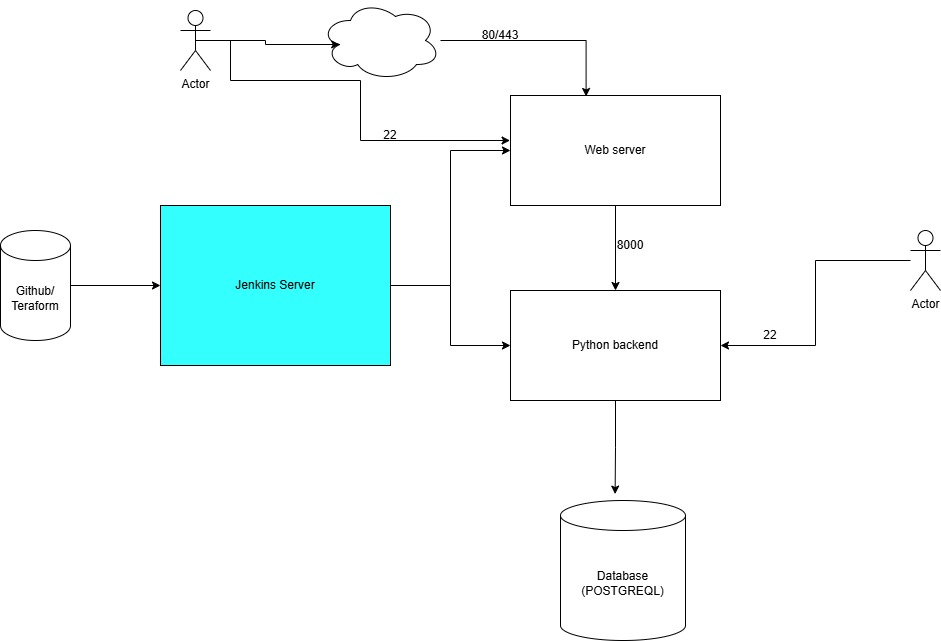

## Fruits Store

A simple fruits store application that allows users to add, remove, and view their favorite fruits.

## Note

- The frontend points to python backend on `localhost:8000`. You might need to update this

## Frontend Requirements
 - git clone https://github.com/albert85/fruits-veg_market.git;
 - cd fruits-veg_market;
 - git checkout ft/mini-project;
 - cd frontend;
 - Replace the SITE_URL (BACKEND_URL)

##  Python Requirments
 - git clone https://github.com/albert85/fruits-veg_market.git;
 - cd fruits-veg_market;
 - git checkout ft/mini-project;
 - cd backend-api;
 - python3 -m venv .venv;
 - source .venv/bin/activate;
 - pip install -r requirements.txt
 - run app `uvicorn main:app --host 0.0.0.0 --port 8000 &`

